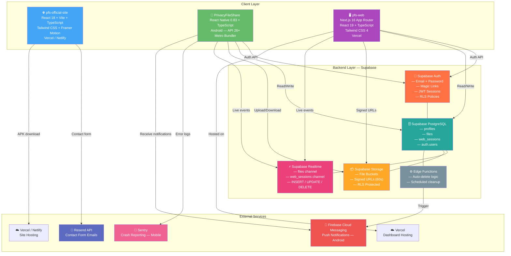
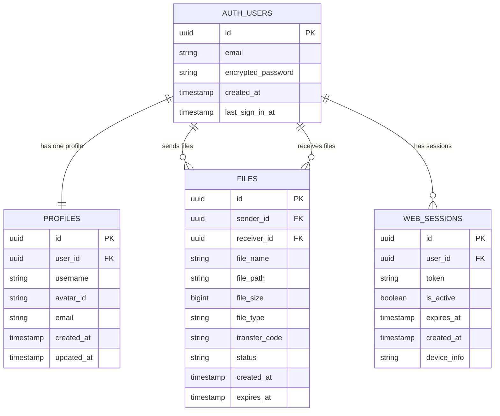
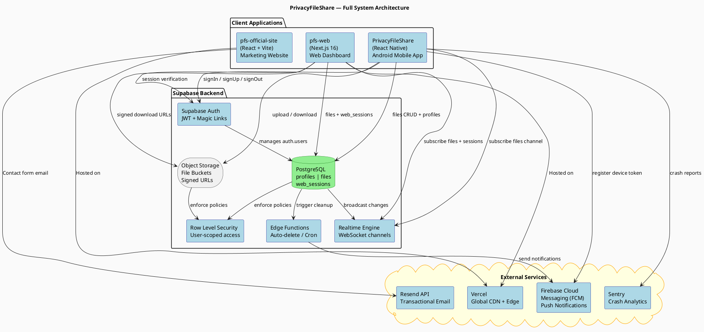
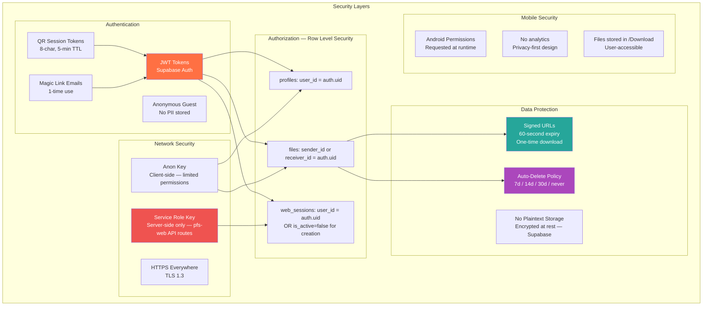

# PrivacyFileShare — Architecture Diagrams

> **How to use this file:**
> Paste any Mermaid block into Claude, Gemini, ChatGPT, or GitHub and ask to render it.
> Paste PlantUML blocks into https://www.plantuml.com/plantuml/uml/

---

## 1. High-Level System Architecture (Mermaid)



---

## 2. Database Schema Architecture (Mermaid ER Diagram)



---

## 3. Mobile App Component Architecture (Mermaid)

```mermaid
graph TD

    subgraph "Entry Point"
        APP[App.tsx\nRoot Component]
    end

    subgraph "Navigation Layer"
        NAV[React Navigation\nRoot Navigator]
        AUTH_NAV[Auth Stack Navigator\nLogin / Signup / Onboarding]
        MAIN_NAV[Main Tab Navigator\nBottom Tabs]
    end

    subgraph "Screens"
        HOME[HomeScreen\nSend / Receive CTA]
        SEND[SendScreen\nFile selection + QR]
        RECV[ReceiveScreen\nQR display + scan]
        HIST[HistoryScreen\nTransfer list + search]
        SETT[SettingsScreen\nProfile + preferences]
        ONBOARD[OnboardingScreen]
        LOGIN[LoginScreen]
        SIGNUP[SignupScreen]
        LINKED[LinkedDevicesScreen]
        FILE_DET[FileDetailScreen]
    end

    subgraph "State Management — Zustand"
        authStore[authStore\nuser, guest, token, profile]
        themeStore[themeStore\ndark / light mode]
        autoDeleteStore[autoDeleteStore\ndelete interval setting]
        compressionStore[compressionStore\nimage compress flag]
        onboardingStore[onboardingStore\ncompleted flag]
    end

    subgraph "Services Layer"
        fileService[fileService\nupload, download, delete]
        authService[authService\nsignUp, signIn, signOut]
        compressionService[compressionService\nresize images]
        updateService[updateService\ncheck latest version]
        webSessionService[webSessionService\nQR sessions CRUD]
        notifService[notificationService\nFCM tokens, local]
        hapticService[hapticService\nfeedback triggers]
        downloadService[downloadService\nfile save to device]
    end

    subgraph "External SDKs"
        SUPABASE[Supabase JS SDK\nauth + db + storage + realtime]
        CAMERA[react-native-camera-kit\nQR scanning]
        BLOBUTIL[react-native-blob-util\nfile download]
        IMGPICKER[react-native-image-picker\nphoto/doc picker]
        DOCPICKER[@react-native-documents/picker\ndocument picker]
        SENTRY_SDK[Sentry SDK\ncrash tracking]
        FCM_SDK[Firebase Messaging\npush notifications]
        RNFS[react-native-fs\nfile system ops]
    end

    APP --> NAV
    NAV --> AUTH_NAV
    NAV --> MAIN_NAV

    AUTH_NAV --> ONBOARD
    AUTH_NAV --> LOGIN
    AUTH_NAV --> SIGNUP

    MAIN_NAV --> HOME
    MAIN_NAV --> HIST
    MAIN_NAV --> SETT

    HOME --> SEND
    HOME --> RECV
    SETT --> LINKED
    HIST --> FILE_DET

    SEND --> fileService
    SEND --> compressionService
    SEND --> hapticService

    RECV --> fileService
    RECV --> CAMERA
    RECV --> hapticService

    HIST --> fileService
    SETT --> authService
    SETT --> webSessionService

    fileService --> SUPABASE
    fileService --> BLOBUTIL
    fileService --> RNFS
    authService --> SUPABASE
    webSessionService --> SUPABASE
    compressionService --> IMGPICKER
    downloadService --> BLOBUTIL
    notifService --> FCM_SDK

    authStore -.->|reads| LOGIN
    authStore -.->|reads| SEND
    authStore -.->|reads| RECV
    themeStore -.->|reads| APP

    style APP fill:#4CAF50,color:#fff
    style SUPABASE fill:#3ECF8E,color:#fff
    style authStore fill:#FF9800,color:#fff
    style themeStore fill:#FF9800,color:#fff
```

---

## 4. Web Dashboard Component Architecture (Mermaid)

```mermaid
graph TD

    subgraph "Next.js App Router Structure"
        ROOT[app/layout.tsx\nRoot Layout + Providers]
        AUTH_GROUP["(auth) group\nNo sidebar"]
        DASH_GROUP["(dashboard) group\nWith sidebar layout"]
    end

    subgraph "Auth Pages"
        QR_LOGIN[qr-login/page.tsx\nQR Code Login]
        EMAIL_LOGIN[email-login/page.tsx\nEmail Login]
    end

    subgraph "Dashboard Pages"
        HOME_P[home/page.tsx\nReceived Files List]
        HIST_P[history/page.tsx\nTransfer History]
        MYQR_P[my-qr/page.tsx\nMy QR Code Display]
        SETT_P[settings/page.tsx\nUser Settings]
    end

    subgraph "API Routes"
        API_QR[/api/web-sessions/create\nGenerate QR session token]
        API_EMAIL[/api/web-sessions/create-email\nEmail session creation]
        API_SIGNED[/api/files/signed-url\nGet download URL]
        API_DELETE[/api/delete-account\nPermanent account deletion]
    end

    subgraph "Hooks"
        useAuth[useAuth\nuser, profile, logout, loading]
        useRealtime[useRealtimeFiles\nSupabase realtime subscription\nINSERT/UPDATE/DELETE]
    end

    subgraph "State — Zustand"
        authStore_W[authStore\nuser, profile, token]
        filesStore[filesStore\nfiles list]
    end

    subgraph "Supabase Client"
        SB_CLIENT[createClient\nbrowser client]
        SB_SERVER[createClient\nserver-side — service role]
    end

    ROOT --> AUTH_GROUP
    ROOT --> DASH_GROUP

    AUTH_GROUP --> QR_LOGIN
    AUTH_GROUP --> EMAIL_LOGIN

    DASH_GROUP --> HOME_P
    DASH_GROUP --> HIST_P
    DASH_GROUP --> MYQR_P
    DASH_GROUP --> SETT_P

    QR_LOGIN --> API_QR
    EMAIL_LOGIN --> API_EMAIL
    HOME_P --> API_SIGNED
    SETT_P --> API_DELETE

    HOME_P --> useRealtime
    HOME_P --> useAuth

    useAuth --> authStore_W
    useRealtime --> filesStore
    useRealtime --> SB_CLIENT
    useAuth --> SB_CLIENT
    API_QR --> SB_SERVER
    API_EMAIL --> SB_SERVER
    API_SIGNED --> SB_SERVER
    API_DELETE --> SB_SERVER

    style ROOT fill:#AB47BC,color:#fff
    style SB_CLIENT fill:#3ECF8E,color:#fff
    style SB_SERVER fill:#3ECF8E,color:#fff
    style authStore_W fill:#FF9800,color:#fff
    style filesStore fill:#FF9800,color:#fff
```

---

## 5. Official Site Architecture (Mermaid)

```mermaid
graph TD

    subgraph "pfs-official-site — React SPA"
        ENTRY[main.tsx\nReact 18 + Vite entry]
        APP_TSX[App.tsx\nReact Router setup]

        subgraph "Pages"
            INDEX[Index.tsx\nFull homepage]
            BLOG_LIST[Blog.tsx\nPost list]
            BLOG_POST[BlogPost.tsx\nSingle post — Markdown]
            CONTACT_P[Contact.tsx\nContact form]
            ABOUT_P[About.tsx]
            PRIVACY_P[Privacy.tsx]
            TOS_P[Terms.tsx]
            NOTFOUND[404.tsx]
        end

        subgraph "Homepage Sections"
            HERO[HeroSection]
            FEATURES[FeaturesSection]
            STATS[StatsSection]
            HOWITWORKS[HowItWorksSection]
            FAQ_SEC[FAQSection]
            CTA[CTASection]
        end

        subgraph "Blog System"
            BLOG_CONTENT[/src/content/blogs/\n*.md files\ngray-matter frontmatter]
            BLOG_UTILS[Blog utilities\nparser + router]
        end

        subgraph "API Handler"
            EMAIL_API[/api/send-email.ts\nResend integration]
        end

        subgraph "Shared Components"
            NAVBAR[Navbar]
            FOOTER[Footer]
            UI_LIB[shadcn/ui components]
        end
    end

    subgraph "External"
        RESEND_EXT[Resend API\nEmail delivery]
        VERCEL_EXT[Vercel Edge Network\nGlobal CDN]
        APK[/public/appapk/\nAndroid APK download]
    end

    ENTRY --> APP_TSX
    APP_TSX --> INDEX
    APP_TSX --> BLOG_LIST
    APP_TSX --> BLOG_POST
    APP_TSX --> CONTACT_P
    APP_TSX --> ABOUT_P
    APP_TSX --> PRIVACY_P
    APP_TSX --> TOS_P
    APP_TSX --> NOTFOUND

    INDEX --> HERO
    INDEX --> FEATURES
    INDEX --> STATS
    INDEX --> HOWITWORKS
    INDEX --> FAQ_SEC
    INDEX --> CTA

    BLOG_LIST --> BLOG_CONTENT
    BLOG_POST --> BLOG_CONTENT
    BLOG_CONTENT --> BLOG_UTILS

    CONTACT_P --> EMAIL_API
    EMAIL_API --> RESEND_EXT

    CTA --> APK
    VERCEL_EXT --> APP_TSX

    style ENTRY fill:#42A5F5,color:#fff
    style RESEND_EXT fill:#5C6BC0,color:#fff
    style VERCEL_EXT fill:#000,color:#fff
```

---

## 6. Full Data Flow Architecture — PlantUML

> Paste into https://www.plantuml.com/plantuml/uml/



---

## 7. Security Architecture (Mermaid)



---

## Architecture Decision Summary

| Decision | Choice | Reason |
|---|---|---|
| **Backend** | Supabase | Realtime, Auth, Storage, PostgreSQL — all in one |
| **Mobile** | React Native | Cross-platform capable, TypeScript, large ecosystem |
| **Web framework** | Next.js App Router | SSR for auth, API routes, Vercel native |
| **State** | Zustand | Lightweight, persistent, no boilerplate |
| **File hosting** | Supabase Storage | Same Supabase project, RLS enforcement |
| **Realtime** | Supabase Realtime | No extra infra, WebSocket channels |
| **Auth** | Supabase Auth | JWT, magic links, RLS integration |
| **Push** | Firebase Cloud Messaging | Android standard, reliable delivery |
| **Email** | Resend | Simple API, reliable deliverability |
| **Error tracking** | Sentry | Mobile SDK, stack traces, breadcrumbs |
| **Marketing** | React + Vite | Fast builds, SEO-capable, minimal overhead |
| **Deployment** | Vercel | Auto-deploy, edge CDN, env var management |
