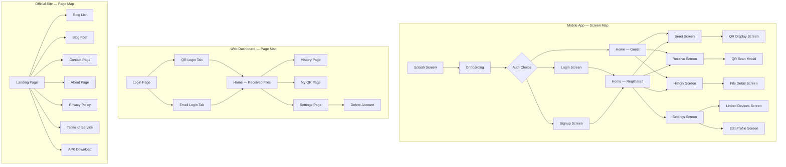

# PrivacyFileShare — Prototype & Wireframe Specification

> **How to use this file:**
> Paste any section into Claude, Gemini, ChatGPT, or a design AI and say:
> *"Generate a UI prototype / wireframe based on this spec"*
> Works with: **v0.dev**, **Galileo AI**, **Uizard**, **Figma AI**, **Framer AI**, **Locofy**, **Claude Artifacts**

---

## GLOBAL DESIGN SYSTEM

```
Design Language:   Material Design 3 (mobile) + shadcn/ui (web)
Color Palette:
  Primary:         #1A73E8  (Blue)
  Secondary:       #34A853  (Green — success)
  Danger:          #EA4335  (Red)
  Warning:         #FBBC04  (Yellow)
  Background Dark: #121212
  Background Light:#F8F9FA
  Surface Dark:    #1E1E1E
  Surface Light:   #FFFFFF
  Text Primary:    #202124 (light) / #E8EAED (dark)
  Text Secondary:  #5F6368 (light) / #9AA0A6 (dark)

Typography:
  Font Family:     Inter (web), System font (mobile)
  Heading 1:       32px Bold
  Heading 2:       24px SemiBold
  Heading 3:       18px SemiBold
  Body:            14px Regular
  Caption:         12px Regular

Spacing Unit:      8px base grid
Border Radius:     12px cards, 8px buttons, 24px pills
Elevation:         4dp cards, 8dp modals, 16dp bottom sheets
Icons:             Lucide React (web), react-native-vector-icons (mobile)
```

---

## SECTION A — MOBILE APP (PrivacyFileShare Android)

### Screen Dimensions: 390 × 844 px (iPhone 14 base, scales to Android)

---

### A1. Onboarding Screen

```
┌─────────────────────────────────┐
│         Status Bar              │
├─────────────────────────────────┤
│                                 │
│                                 │
│         [App Logo 80×80]        │
│      🔒 PrivacyFileShare        │
│                                 │
│  ┌─────────────────────────┐    │
│  │   [Illustration 240px]  │    │
│  │  (lock + phone + files) │    │
│  └─────────────────────────┘    │
│                                 │
│   ● ○ ○  ← Page indicator      │
│                                 │
│  ┌─────────────────────────┐    │
│  │  Send Files Privately   │    │
│  │  Share any file type    │    │
│  │  without cloud storage  │    │
│  │  or account creation.   │    │
│  └─────────────────────────┘    │
│                                 │
│  [────────────────────────]     │
│  [   Get Started (Blue)   ]     │
│  [────────────────────────]     │
│                                 │
│    Already have account?        │
│         Log In →                │
│                                 │
└─────────────────────────────────┘

Pages: 3 swipeable cards
  Page 1: "Send Files Privately" — lock + file icon
  Page 2: "No Account Needed" — anonymous avatar icon
  Page 3: "Receive Anywhere" — QR code icon
```

**Prototype Prompt:**
> Create a 3-screen mobile onboarding flow for a privacy-first file sharing Android app called "PrivacyFileShare". Use dark background (#121212), white text, blue (#1A73E8) CTA button. Each screen has: full-width illustration area (top 45%), page dots, large headline, subtitle, and a bottom CTA button. Final screen has "Get Started" + "Log In" link. Include swipe gesture indicator.

---

### A2. Home Screen (Main Hub)

```
┌─────────────────────────────────┐
│  🔒 PrivacyFileShare    [👤]    │  ← Profile icon top right
├─────────────────────────────────┤
│                                 │
│  Good morning, Alex! 👋         │
│  Ready to share privately?      │
│                                 │
├─────────────────────────────────┤
│                                 │
│  ┌──────────────────────────┐   │
│  │  ↑ SEND FILES            │   │
│  │  ─────────────────────   │   │
│  │  Select up to 5 files    │   │
│  │  Generate QR to share    │   │
│  │                          │   │
│  │  [   Send Now  →  ]      │   │  ← Blue button
│  └──────────────────────────┘   │
│                                 │
│  ┌──────────────────────────┐   │
│  │  ↓ RECEIVE FILES         │   │
│  │  ─────────────────────   │   │
│  │  Show your QR code       │   │
│  │  or scan sender's QR     │   │
│  │                          │   │
│  │  [  Receive Now  →  ]    │   │  ← Green button
│  └──────────────────────────┘   │
│                                 │
│  Recent Transfers               │
│  ┌──────────────────────────┐   │
│  │ 📄 document.pdf  2.3MB   │   │
│  │    Sent · 2 min ago   ✓  │   │
│  └──────────────────────────┘   │
│  ┌──────────────────────────┐   │
│  │ 🖼️ photo.jpg    1.1MB   │   │
│  │    Received · 1 hr ago ✓ │   │
│  └──────────────────────────┘   │
│                                 │
├─────────────────────────────────┤
│  [🏠 Home] [📋 History] [⚙️ Settings] │  ← Bottom tab bar
└─────────────────────────────────┘
```

**Prototype Prompt:**
> Create an Android mobile home screen for "PrivacyFileShare". Dark theme (#121212 background, #1E1E1E cards). Top bar: app logo left, profile avatar right. Personalized greeting. Two large action cards: "Send Files" (blue #1A73E8, upload arrow icon) and "Receive Files" (green #34A853, download arrow icon). Below: "Recent Transfers" list with file icon, name, size, sent/received label, timestamp, checkmark. Bottom navigation bar with Home, History, Settings tabs.

---

### A3. Send Screen

```
┌─────────────────────────────────┐
│  ← Back        Send Files       │
├─────────────────────────────────┤
│                                 │
│  Step 1: Select Files           │
│  ─────────────────────────────  │
│                                 │
│  ┌─── Drop zone ─────────────┐  │
│  │                           │  │
│  │    📁                     │  │
│  │  Tap to select files      │  │
│  │  or drag & drop here      │  │
│  │                           │  │
│  │  [  Choose Files  ]       │  │
│  │                           │  │
│  │  Max 5 files · Any type   │  │
│  └───────────────────────────┘  │
│                                 │
│  Selected Files (2/5)           │
│  ┌──────────────────────────┐   │
│  │ 📄 report.pdf   4.2 MB [✕]│  │
│  └──────────────────────────┘   │
│  ┌──────────────────────────┐   │
│  │ 🖼️ photo.png   1.8 MB [✕]│  │
│  └──────────────────────────┘   │
│  [+ Add more files]             │
│                                 │
│  🗜️ Compress images?  [Toggle]  │
│                                 │
│  ████████████░░░░░░░░ 65%       │  ← Upload progress (shown during upload)
│  Uploading... 3.9 MB / 6 MB     │
│                                 │
│  [────────────────────────────] │
│  [   Generate QR Code  🔲  ]   │  ← Disabled until files selected
│  [────────────────────────────] │
│                                 │
└─────────────────────────────────┘
```

**Prototype Prompt:**
> Design a mobile "Send Files" screen for a file sharing app. Dark theme. Top: back arrow + title "Send Files". Large dashed-border drop zone with folder icon and "Tap to select files" text + Choose Files button. Below: selected files list — each row shows file type icon, filename, size, and × remove button. File count badge "2/5". Toggle switch for "Compress images". Progress bar (blue fill) showing upload percentage. Disabled CTA button that activates when files are selected: "Generate QR Code" with QR icon.

---

### A4. QR Code Display Screen (Send)

```
┌─────────────────────────────────┐
│  ← Back      Your Transfer QR   │
├─────────────────────────────────┤
│                                 │
│  ✅ Files uploaded successfully  │
│                                 │
│  ┌──────────────────────────┐   │
│  │                          │   │
│  │   ██████████████████     │   │
│  │   ██ ▄▄▄▄▄ █▄█▄▄▄ ██    │   │
│  │   ██ █   █ █▀ ▄▀▀ ██    │   │  ← Large QR code 240×240
│  │   ██ █▄▄▄█ █▄▀▄█▄ ██    │   │
│  │   ██▄▄▄▄▄▄▄█▄█▄█▄▄██    │   │
│  │   ████▄▀ ▀ ▀▄▄ ▄▄▄██    │   │
│  │   ██████████████████     │   │
│  │                          │   │
│  │     Code: X7K2P9M4       │   │  ← Text code below QR
│  └──────────────────────────┘   │
│                                 │
│  ⏱️ Expires in  04:32           │  ← Countdown timer
│                                 │
│  Files included:                │
│  📄 report.pdf        4.2 MB    │
│  🖼️ photo.png         1.8 MB    │
│                                 │
│  Ask receiver to scan this QR   │
│  or enter the code manually.    │
│                                 │
│  [────────────────────────────] │
│  [      Share Code  📤      ]   │
│  [────────────────────────────] │
│                                 │
│  [────────────────────────────] │
│  [      Done  ✓             ]   │
│  [────────────────────────────] │
│                                 │
└─────────────────────────────────┘
```

**Prototype Prompt:**
> Design a mobile QR code display screen for file transfer. Dark theme. Success checkmark + "Files uploaded successfully" at top. Large centered white QR code box (240×240px) with the generated QR and the text transfer code "X7K2P9M4" below it. Countdown timer "Expires in 04:32" in orange. File list showing what's included. Instruction text. Two buttons: "Share Code" (outlined) and "Done" (filled blue).

---

### A5. Receive Screen

```
┌─────────────────────────────────┐
│  ← Back        Receive Files    │
├─────────────────────────────────┤
│                                 │
│  How would you like to receive? │
│                                 │
│  ┌──── Tab Bar ──────────────┐  │
│  │ [My QR Code] [Scan QR]    │  │
│  └───────────────────────────┘  │
│                                 │
│  ── My QR Code Tab ──           │
│                                 │
│  Show this to the sender        │
│                                 │
│  ┌──────────────────────────┐   │
│  │   [Your QR Code 200px]   │   │
│  │                          │   │
│  │     Alex's Code          │   │
│  │     A3F8K2P1             │   │
│  └──────────────────────────┘   │
│                                 │
│  Waiting for sender...          │
│  ⣾ Listening for files         │  ← Animated spinner
│                                 │
│  ─ OR ─                         │
│                                 │
│  ── Scan QR Tab ──              │
│                                 │
│  ┌──────────────────────────┐   │
│  │  [Camera viewfinder]     │   │
│  │  ┌──────────────────┐    │   │
│  │  │  [ scan target ] │    │   │  ← QR scan frame
│  │  └──────────────────┘    │   │
│  │  Point at sender's QR    │   │
│  └──────────────────────────┘   │
│                                 │
│  Or enter code manually:        │
│  ┌──────────────────────────┐   │
│  │  _  _  _  _  _  _  _  _ │   │  ← 8-char code input
│  └──────────────────────────┘   │
│  [  Fetch Files  ]              │
│                                 │
└─────────────────────────────────┘
```

**Prototype Prompt:**
> Design a "Receive Files" mobile screen with two tabs: "My QR Code" and "Scan QR". My QR tab: displays the user's personal QR code centered with their name and alphanumeric code below, animated listening indicator. Scan QR tab: live camera viewfinder with a square scan frame overlay, and below it an 8-box manual code entry input + "Fetch Files" button. Dark theme, clean layout, blue tab indicator.

---

### A6. Transfer History Screen

```
┌─────────────────────────────────┐
│  History              [Filter▼] │
├─────────────────────────────────┤
│  ┌──────────────────────────┐   │
│  │ 🔍 Search transfers...   │   │  ← Search bar
│  └──────────────────────────┘   │
│                                 │
│  [All] [Sent] [Received]        │  ← Filter pills
│                                 │
│  Today                          │
│  ┌──────────────────────────┐   │
│  │ ↑ 📄 report.pdf          │   │
│  │   Sent to PFS_User_K3X   │   │
│  │   4.2 MB · 2:34 PM    ✓  │   │
│  └──────────────────────────┘   │
│  ┌──────────────────────────┐   │
│  │ ↓ 🖼️ photo.jpg           │   │
│  │   From PFS_User_M7Q      │   │
│  │   1.1 MB · 11:05 AM   ✓  │   │
│  └──────────────────────────┘   │
│                                 │
│  Yesterday                      │
│  ┌──────────────────────────┐   │
│  │ ↑ 📦 archive.zip         │   │
│  │   Sent to PFS_User_R2T   │   │
│  │   18.7 MB · Apr 28    ✓  │   │
│  └──────────────────────────┘   │
│  ┌──────────────────────────┐   │
│  │ ↓ 🎬 video.mp4           │   │
│  │   From PFS_User_L9W      │   │
│  │   55.2 MB · Apr 28    ✓  │   │
│  └──────────────────────────┘   │
│                                 │
│  [Load more transfers...]       │
│                                 │
├─────────────────────────────────┤
│  [🏠 Home] [📋 History] [⚙️]    │
└─────────────────────────────────┘
```

**Prototype Prompt:**
> Design a mobile transfer history screen. Dark theme. Top: title "History" + filter dropdown. Search bar full-width. Three filter pills: All, Sent, Received. Grouped list by date sections (Today, Yesterday, etc). Each list item: directional arrow (↑ sent, ↓ received), file type emoji, filename, sender/receiver label, file size, time, green checkmark. Swipe-to-delete gesture indicator. Pagination "Load more" at bottom. Bottom tab bar.

---

### A7. Settings Screen

```
┌─────────────────────────────────┐
│  Settings                       │
├─────────────────────────────────┤
│                                 │
│  ┌──────────────────────────┐   │
│  │  [Avatar 60px]           │   │
│  │  Alex Johnson            │   │
│  │  alex@email.com          │   │
│  │  [Edit Profile →]        │   │
│  └──────────────────────────┘   │
│                                 │
│  Preferences                    │
│  ────────────────────────────   │
│  ┌──────────────────────────┐   │
│  │ 🌙 Dark Mode        [●] ]│   │  ← Toggle on
│  └──────────────────────────┘   │
│  ┌──────────────────────────┐   │
│  │ 🗜️ Compress Images  [○]  │   │  ← Toggle off
│  └──────────────────────────┘   │
│  ┌──────────────────────────┐   │
│  │ 🗑️ Auto-Delete Files     │   │
│  │                  30 days │   │
│  └──────────────────────────┘   │
│                                 │
│  Storage                        │
│  ────────────────────────────   │
│  ┌──────────────────────────┐   │
│  │ 📁 Download Location     │   │
│  │    /storage/Download  →  │   │
│  └──────────────────────────┘   │
│                                 │
│  Account                        │
│  ────────────────────────────   │
│  ┌──────────────────────────┐   │
│  │ 🔗 Linked Devices      → │   │
│  └──────────────────────────┘   │
│  ┌──────────────────────────┐   │
│  │ 🔔 Notifications       → │   │
│  └──────────────────────────┘   │
│  ┌──────────────────────────┐   │
│  │ ℹ️ App Version   1.1.0   │   │
│  └──────────────────────────┘   │
│                                 │
│  [  Log Out  ]   [Delete Acct]  │
│                                 │
├─────────────────────────────────┤
│  [🏠 Home] [📋 History] [⚙️]    │
└─────────────────────────────────┘
```

**Prototype Prompt:**
> Design a mobile settings screen. Dark theme. Top: user profile card with circular avatar, name, email, "Edit Profile" link. Grouped settings sections: "Preferences" (Dark Mode toggle, Compress Images toggle, Auto-Delete with value), "Storage" (Download Location row), "Account" (Linked Devices, Notifications, App Version rows). Bottom: two text buttons "Log Out" and "Delete Account" (red). Each row uses chevron arrow for navigation. Bottom tab bar.

---

### A8. Linked Devices Screen

```
┌─────────────────────────────────┐
│  ← Back      Linked Devices     │
├─────────────────────────────────┤
│                                 │
│  Devices with access to your    │
│  PrivacyFileShare account       │
│                                 │
│  Active Sessions (2)            │
│  ────────────────────────────   │
│  ┌──────────────────────────┐   │
│  │ 🖥️ Chrome on Windows     │   │
│  │   Activated · 2 hrs ago  │   │
│  │   Current session        │   │
│  │               [Revoke]   │   │
│  └──────────────────────────┘   │
│  ┌──────────────────────────┐   │
│  │ 🌐 Firefox on macOS      │   │
│  │   Activated · Yesterday  │   │
│  │                          │   │
│  │               [Revoke]   │   │
│  └──────────────────────────┘   │
│                                 │
│  [  Revoke All Sessions  ]      │  ← Red outlined button
│                                 │
│  ──────────────────────────     │
│                                 │
│  💡 Linked devices can view     │
│     and download your files     │
│     from any browser.           │
│                                 │
│  How to link a new device:      │
│  1. Visit pfs-web on desktop    │
│  2. Select "QR Login"           │
│  3. Scan QR with this app       │
│                                 │
└─────────────────────────────────┘
```

**Prototype Prompt:**
> Design a "Linked Devices" mobile screen. Dark theme. Subtitle explaining what linked devices are. List of active sessions — each card: browser icon, browser/OS label, activation time, "Revoke" button (red text). "Revoke All Sessions" outlined red button. Info box explaining how linked devices work. Step-by-step instructions for linking a new device. Back navigation.

---

## SECTION B — WEB DASHBOARD (pfs-web)

### Viewport: 1280 × 800 px desktop, responsive to 768px tablet

---

### B1. QR Login Page

```
┌──────────────────────────────────────────────────────────────────┐
│  🔒 PrivacyFileShare Web                              [?] Help   │
├──────────────────────────────────────────────────────────────────┤
│                                                                  │
│               ┌───────────────────────────────┐                  │
│               │                               │                  │
│               │     🔒 PrivacyFileShare       │                  │
│               │        Web Dashboard          │                  │
│               │                               │                  │
│               │   ┌─── Tab ──────────────┐   │                  │
│               │   │ [QR Login] [Email]   │   │                  │
│               │   └──────────────────────┘   │                  │
│               │                               │                  │
│               │   ┌──────────────────────┐   │                  │
│               │   │                      │   │                  │
│               │   │   [QR Code 200×200]  │   │                  │
│               │   │                      │   │                  │
│               │   └──────────────────────┘   │                  │
│               │                               │                  │
│               │   ⏱️ Expires in 04:47         │                  │
│               │   [  Refresh QR  🔄  ]        │                  │
│               │                               │                  │
│               │   ─────── How to login ─────  │                  │
│               │   1. Open PFS app on phone    │                  │
│               │   2. Go to Settings           │                  │
│               │   3. Tap "Link Web Device"    │                  │
│               │   4. Scan this QR code        │                  │
│               │                               │                  │
│               └───────────────────────────────┘                  │
│                                                                  │
└──────────────────────────────────────────────────────────────────┘
```

**Prototype Prompt:**
> Design a web login page for "PrivacyFileShare Web Dashboard". Clean minimal layout, centered card (max-width 420px) on a dark gray background (#121212). Card: app logo + title. Two tabs: "QR Login" and "Email Login". QR Login tab: large QR code centered (200×200px), countdown timer in orange, "Refresh QR" button. Step-by-step instructions numbered 1–4. Email tab: email input + "Send Magic Link" button. shadcn/ui components, Inter font, rounded-2xl card.

---

### B2. Web Dashboard — Received Files (Home)

```
┌──────────────────────────────────────────────────────────────────┐
│ [≡] 🔒 PFS Web         🔍 Search files...           [👤 Alex ▼] │
├───────────┬──────────────────────────────────────────────────────┤
│           │                                                      │
│  📥 Home  │  Received Files                                      │
│           │  ──────────────────────────────────────────────────  │
│  📋 Hist  │                                                      │
│           │  ┌─────────────┐  ┌─────────────┐  ┌────────────┐  │
│  🔲 My QR │  │ 📄          │  │ 🖼️          │  │ 📦         │  │
│           │  │ report.pdf  │  │ photo.jpg   │  │ archive.zip│  │
│  ⚙️ Sett  │  │ 4.2 MB      │  │ 1.1 MB      │  │ 18.7 MB    │  │
│           │  │ 2 min ago   │  │ 1 hr ago    │  │ Yesterday  │  │
│  ─────    │  │ from Alex   │  │ from Bob    │  │ from Carol │  │
│           │  │ [↓ Download]│  │ [↓ Download]│  │ [↓ Download│  │
│           │  │    [🗑️]     │  │    [🗑️]     │  │    [🗑️]    │  │
│           │  └─────────────┘  └─────────────┘  └────────────┘  │
│           │                                                      │
│           │  ┌─────────────┐  ┌─────────────┐                  │
│           │  │ 🎬          │  │ 📝          │                  │
│           │  │ video.mp4   │  │ notes.txt   │                  │
│           │  │ 55.2 MB     │  │ 0.1 MB      │                  │
│           │  │ 2 days ago  │  │ 3 days ago  │                  │
│           │  │ from Dave   │  │ from Eve    │                  │
│           │  │ [↓ Download]│  │ [↓ Download]│                  │
│           │  │    [🗑️]     │  │    [🗑️]     │                  │
│           │  └─────────────┘  └─────────────┘                  │
│           │                                                      │
│           │  ─────────────────────────────────────────────────  │
│           │  5 files · 79.3 MB total                            │
│           │                                                      │
└───────────┴──────────────────────────────────────────────────────┘

Toast notification (top-right):
┌────────────────────────────┐
│ 🔔 New file received!      │
│ report.pdf from Alex       │
│ [Download]         [✕]     │
└────────────────────────────┘
```

**Prototype Prompt:**
> Design a web dashboard for "PrivacyFileShare Web". Dark theme (#121212 bg, #1E1E1E sidebar, #2A2A2A cards). Left sidebar (240px wide): logo, nav links (Home, History, My QR, Settings) with active state indicator. Top bar: global search, user avatar dropdown. Main area: "Received Files" title, responsive grid of file cards (3 columns on desktop). Each card: large file type icon, filename, size, relative time, sender name, Download button (blue), Delete icon (red). Bottom summary bar. Real-time toast notification in top-right corner. shadcn/ui card components.

---

### B3. Transfer History Page (Web)

```
┌──────────────────────────────────────────────────────────────────┐
│ [≡] 🔒 PFS Web         🔍 Search files...           [👤 Alex ▼] │
├───────────┬──────────────────────────────────────────────────────┤
│           │                                                      │
│  📥 Home  │  Transfer History                    [Export CSV ↓] │
│           │  ──────────────────────────────────────────────────  │
│  📋 Hist  │                                                      │
│ (active)  │  Filters:  [All ▼]  [This Month ▼]  [🔍 Search]    │
│           │                                                      │
│  🔲 My QR │  ┌────────────────────────────────────────────────┐ │
│           │  │ File Name    │ Type │ Size  │ From   │ Date   ↕│ │
│  ⚙️ Sett  │  ├────────────────────────────────────────────────┤ │
│           │  │ report.pdf   │  ↓  │ 4.2MB │ Alex   │ 2:34PM │ │
│           │  │ photo.jpg    │  ↓  │ 1.1MB │ Bob    │ 11:05AM│ │
│           │  │ archive.zip  │  ↑  │18.7MB │ —      │ Apr 28 │ │
│           │  │ video.mp4    │  ↓  │55.2MB │ Dave   │ Apr 27 │ │
│           │  │ notes.txt    │  ↓  │ 0.1MB │ Eve    │ Apr 26 │ │
│           │  ├────────────────────────────────────────────────┤ │
│           │  │          ← 1 2 3 ... 12 →                      │ │
│           │  └────────────────────────────────────────────────┘ │
│           │                                                      │
│           │  Summary: 48 files received · 12 sent · 2.1 GB     │
│           │                                                      │
└───────────┴──────────────────────────────────────────────────────┘
```

**Prototype Prompt:**
> Design a web "Transfer History" page with the same sidebar layout. Main area: title + "Export CSV" button. Filter row: type dropdown, date range dropdown, search input. Data table with columns: File Name (clickable), Type (↑ sent ↓ received arrow), Size, From/To user, Date. Sortable column headers. Row hover highlight. Pagination at bottom. Summary stats bar below table. Dark theme, shadcn/ui Table component.

---

### B4. My QR Code Page (Web)

```
┌──────────────────────────────────────────────────────────────────┐
│ [≡] 🔒 PFS Web         🔍 Search files...           [👤 Alex ▼] │
├───────────┬──────────────────────────────────────────────────────┤
│           │                                                      │
│  📥 Home  │  My QR Code                                         │
│  📋 Hist  │  ──────────────────────────────────────────────────  │
│  🔲 My QR │                                                      │
│ (active)  │        ┌─────────────────────────────────┐           │
│  ⚙️ Sett  │        │                                 │           │
│           │        │                                 │           │
│           │        │      [QR Code  280×280px]       │           │
│           │        │                                 │           │
│           │        │                                 │           │
│           │        │         Alex's Code             │           │
│           │        │         A3F8K2P1                │           │
│           │        │                                 │           │
│           │        │  [↓ Download PNG]  [📋 Copy]   │           │
│           │        │                                 │           │
│           │        └─────────────────────────────────┘           │
│           │                                                      │
│           │   ℹ️  Share this QR with anyone who wants            │
│           │      to send you files from the mobile app.          │
│           │                                                      │
│           │   How to use:                                        │
│           │   1. Share this QR or code with a sender             │
│           │   2. Sender scans it in PrivacyFileShare app         │
│           │   3. Files appear in your Home dashboard             │
│           │                                                      │
└───────────┴──────────────────────────────────────────────────────┘
```

**Prototype Prompt:**
> Design a "My QR Code" web page. Centered card (max-width 480px) showing a large QR code (280×280px), the user's display name, and their alphanumeric code below it. Two buttons below QR: "Download PNG" and "Copy Code". Info callout box explaining what the QR is for. Numbered instructions (1–3) on how to use it. Same dark sidebar layout as other dashboard pages.

---

## SECTION C — OFFICIAL MARKETING SITE (pfs-official-site)

### Viewport: 1440 × 900 px desktop, responsive

---

### C1. Hero Section

```
┌──────────────────────────────────────────────────────────────────────────────┐
│  🔒 PrivacyFileShare     Features  Blog  About  Contact     [Download App ↓] │
├──────────────────────────────────────────────────────────────────────────────┤
│                                                                              │
│    ┌────────────────────────────────┐   ┌────────────────────────────────┐  │
│    │                                │   │                                │  │
│    │  Share Files.                  │   │     [App Screenshot/         │  │
│    │  Completely Private.           │   │      Mockup — Phone          │  │
│    │                                │   │      showing Send Screen]    │  │
│    │  No cloud. No account needed.  │   │                                │  │
│    │  Just scan, send, done.        │   │                                │  │
│    │                                │   │                                │  │
│    │  [  Download Free APK  ↓  ]   │   │                                │  │
│    │  [  Learn More  →         ]   │   │                                │  │
│    │                                │   └────────────────────────────────┘  │
│    │  ★★★★★  4.9 · Privacy-first    │                                        │
│    │                                │                                        │
│    └────────────────────────────────┘                                        │
│                                                                              │
│  ──────── Trusted for privacy ──────────────────────────────────────────    │
│  🔒 No Cloud    📵 No Account    🔑 QR-Based    📱 Android Native           │
│                                                                              │
└──────────────────────────────────────────────────────────────────────────────┘
```

**Prototype Prompt:**
> Design a hero section for a privacy-first file sharing app landing page. Dark background (#121212). Split layout: left column has headline "Share Files. Completely Private.", subtitle "No cloud. No account needed. Just scan, send, done.", primary CTA "Download Free APK" (blue filled button), secondary CTA "Learn More" (outlined). Star rating badge. Right column: phone mockup/screenshot. Below: trust strip with 4 feature pills: No Cloud, No Account, QR-Based, Android Native. Sticky navbar with logo, nav links, and "Download App" button.

---

### C2. Features Section

```
┌──────────────────────────────────────────────────────────────────────────────┐
│                                                                              │
│                     Why PrivacyFileShare?                                   │
│                 Privacy without compromise.                                 │
│                                                                              │
│   ┌──────────────┐  ┌──────────────┐  ┌──────────────┐  ┌──────────────┐  │
│   │      🔒      │  │      📵      │  │      🔲      │  │      ⚡      │  │
│   │  No Account  │  │  No Cloud    │  │  QR Transfer │  │  Lightning   │  │
│   │   Needed     │  │  Storage     │  │    System    │  │    Fast      │  │
│   │              │  │              │  │              │  │              │  │
│   │ Share files  │  │ Files go     │  │ Unique QR    │  │ Real-time    │  │
│   │ instantly    │  │ directly     │  │ codes per    │  │ transfer     │  │
│   │ as a guest   │  │ device to    │  │ transfer,    │  │ progress     │  │
│   │ — no sign-up │  │ device only  │  │ 8-char code  │  │ tracking     │  │
│   └──────────────┘  └──────────────┘  └──────────────┘  └──────────────┘  │
│                                                                              │
│   ┌──────────────┐  ┌──────────────┐  ┌──────────────┐  ┌──────────────┐  │
│   │      📁      │  │      🌐      │  │      🗑️      │  │      📱      │  │
│   │  Any File    │  │  Web Linked  │  │  Auto-Delete │  │  Android     │  │
│   │    Type      │  │   Devices    │  │   Settings   │  │  Native      │  │
│   │              │  │              │  │              │  │              │  │
│   │ Docs, images │  │ Receive on   │  │ Files auto-  │  │ Built with   │  │
│   │ videos, PDFs │  │ desktop via  │  │ purge after  │  │ React Native │  │
│   │ archives...  │  │ QR pairing   │  │ 7–30 days    │  │ API 26+      │  │
│   └──────────────┘  └──────────────┘  └──────────────┘  └──────────────┘  │
│                                                                              │
└──────────────────────────────────────────────────────────────────────────────┘
```

**Prototype Prompt:**
> Design a features grid section for a landing page. Dark background. Section heading "Why PrivacyFileShare?" + subtitle. 4-column grid (2 rows = 8 feature cards total). Each card: emoji icon (64px), bold feature title, 2-line description. Cards have dark surface (#1E1E1E) background, subtle border, hover lift effect. Features: No Account Needed, No Cloud Storage, QR Transfer System, Lightning Fast, Any File Type, Web Linked Devices, Auto-Delete Settings, Android Native.

---

### C3. How It Works Section

```
┌──────────────────────────────────────────────────────────────────────────────┐
│                                                                              │
│                        How It Works                                         │
│                   Three steps. Zero friction.                               │
│                                                                              │
│                                                                              │
│   ①──────────────────②──────────────────③                                  │
│   │                  │                  │                                   │
│                                                                              │
│  ┌─────────────────┐  ┌─────────────────┐  ┌─────────────────┐             │
│  │                 │  │                 │  │                 │             │
│  │  [Select Files] │  │ [QR Generated]  │  │ [Download done] │             │
│  │   screenshot    │  │  screenshot     │  │   screenshot    │             │
│  │                 │  │                 │  │                 │             │
│  │ 1. Select       │  │ 2. Share QR     │  │ 3. Receiver     │             │
│  │ your files in   │  │ code with the   │  │ scans & files   │             │
│  │ the app — up    │  │ receiver. They  │  │ download        │             │
│  │ to 5 files per  │  │ scan it with    │  │ instantly.      │             │
│  │ transfer.       │  │ the PFS app.    │  │ Done!           │             │
│  └─────────────────┘  └─────────────────┘  └─────────────────┘             │
│                                                                              │
│                    [  Download App & Try Now  ]                             │
│                                                                              │
└──────────────────────────────────────────────────────────────────────────────┘
```

**Prototype Prompt:**
> Design a "How It Works" section with 3 steps connected by a progress line/connector. Dark theme. Each step has a numbered circle (1, 2, 3), a phone screenshot mockup, bold step title, and 2-3 sentence description. Steps: "1. Select your files", "2. Share QR code", "3. Receiver scans & downloads". Connected by dotted line between steps. CTA button at bottom. Animated step numbers that light up on scroll.

---

### C4. Stats Section

```
┌──────────────────────────────────────────────────────────────────────────────┐
│                                                                              │
│          ┌──────────────────────────────────────────────────────┐           │
│          │                                                      │           │
│          │   10,000+          5 Files           0 MB           │           │
│          │   Transfers        Per Transfer       Cloud Storage  │           │
│          │   Completed        Supported          Used           │           │
│          │                                                      │           │
│          │   100%             8 Chars            30 Days        │           │
│          │   Privacy          QR Code            Max Auto-      │           │
│          │   Guaranteed       Transfer Code      Delete Period  │           │
│          │                                                      │           │
│          └──────────────────────────────────────────────────────┘           │
│                                                                              │
└──────────────────────────────────────────────────────────────────────────────┘
```

**Prototype Prompt:**
> Design a stats/metrics band section for a landing page. Dark blue gradient background or dark surface with border. 2-row × 3-column grid of stat blocks. Each block: large bold number/value (48px white), small label below (14px gray). Stats: "10,000+ Transfers Completed", "5 Files Per Transfer", "0 MB Cloud Storage Used", "100% Privacy Guaranteed", "8 Chars QR Code", "30 Days Max Auto-Delete". Animated count-up effect on scroll.

---

## SECTION D — PROTOTYPE NAVIGATION MAP



---

## SECTION E — COMPONENT SPECIFICATION TABLE

| Component | Used In | Description | Props / States |
|---|---|---|---|
| **FileCard** | Mobile History, Web Home | File icon + name + size + timestamp | type, name, size, date, direction, onDownload, onDelete |
| **QRDisplay** | Mobile Send/Receive, Web My QR | Renders QR SVG + code text | transferCode, expiresAt, onRefresh |
| **QRScanner** | Mobile Receive | Camera viewfinder with scan frame | onScanned, onClose |
| **ProgressBar** | Mobile Send | Upload/download % bar | value, total, label |
| **TransferCard** | Mobile Home | Quick action card | type (send/receive), onPress |
| **Avatar** | All apps | Circular user profile image | userId, size, avatarId |
| **FileTypeBadge** | Web Home | Colored icon per file type | mimeType |
| **SessionCard** | Mobile Linked Devices | Active web session info | deviceInfo, createdAt, onRevoke |
| **ToastNotif** | Web Dashboard | Real-time file toast | filename, sender, onDownload |
| **StatsGrid** | Official Site | Animated metric tiles | stats[] |
| **BlogCard** | Official Site Blog | Post preview card | title, excerpt, date, slug |
| **FAQAccordion** | Official Site | Expandable Q&A | items[], defaultOpen |
| **NavBar** | All | Responsive navigation | links[], ctaLabel, onCTA |
| **ThemeToggle** | Mobile, Web | Dark/light toggle | current, onChange |
| **AutoDeletePicker** | Mobile Settings | Interval selector | value, options[], onChange |

---

## SECTION F — PROMPT TEMPLATES FOR AI TOOLS

### For Claude Artifacts
```
Create a React component prototype for the [SCREEN NAME] screen of PrivacyFileShare.
Use Tailwind CSS, dark theme (#121212 background, #1E1E1E cards, #1A73E8 primary blue).
Component details: [PASTE WIREFRAME ABOVE]
Make it interactive with useState for [toggle/input/tab] states.
Use Lucide icons. No external dependencies beyond React + Tailwind.
```

### For v0.dev
```
Build a [mobile/web] UI for PrivacyFileShare — a privacy-first file sharing app.
Screen: [SCREEN NAME]
Design: Dark theme, shadcn/ui components, Tailwind CSS
Layout: [PASTE WIREFRAME ABOVE]
Include: [specific interactions like hover states, active tabs, progress bars]
```

### For Figma AI / Galileo AI
```
Design a [mobile/desktop] screen for PrivacyFileShare app.
Screen name: [SCREEN NAME]
Style: Material Design 3, dark theme, primary color #1A73E8
Layout reference: [PASTE WIREFRAME ABOVE]
Font: Inter
Include all UI states: default, loading, error, empty, success
```

### For Framer AI
```
Create a prototype page for [SCREEN NAME] screen.
App: PrivacyFileShare — Android file sharing
Color palette: #121212 bg, #1E1E1E surface, #1A73E8 blue, #34A853 green
Layout: [PASTE WIREFRAME ABOVE]
Interactions: [specify taps, transitions, animations needed]
```

---

## PROTOTYPE CHECKLIST

- [ ] Mobile: Onboarding (3 slides)
- [ ] Mobile: Home Screen
- [ ] Mobile: Send Screen + QR Display
- [ ] Mobile: Receive Screen + QR Scanner
- [ ] Mobile: History Screen
- [ ] Mobile: Settings Screen
- [ ] Mobile: Linked Devices Screen
- [ ] Mobile: Edit Profile Screen
- [ ] Web: QR Login Page
- [ ] Web: Email Login Page
- [ ] Web: Dashboard — Received Files
- [ ] Web: Transfer History
- [ ] Web: My QR Code
- [ ] Web: Settings
- [ ] Site: Hero Section
- [ ] Site: Features Grid
- [ ] Site: How It Works
- [ ] Site: Stats Band
- [ ] Site: FAQ Section
- [ ] Site: Blog List
- [ ] Site: Blog Post
- [ ] Site: Contact Page
