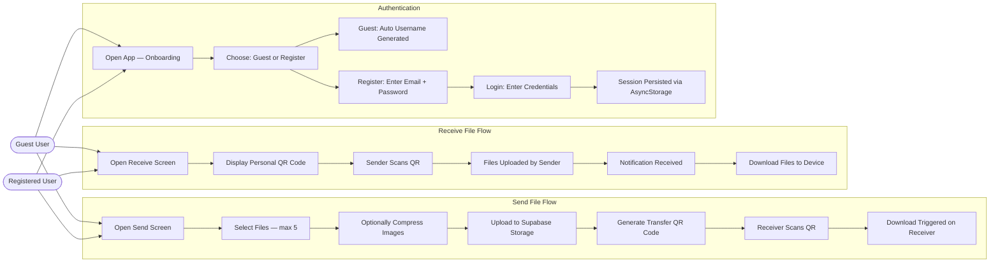
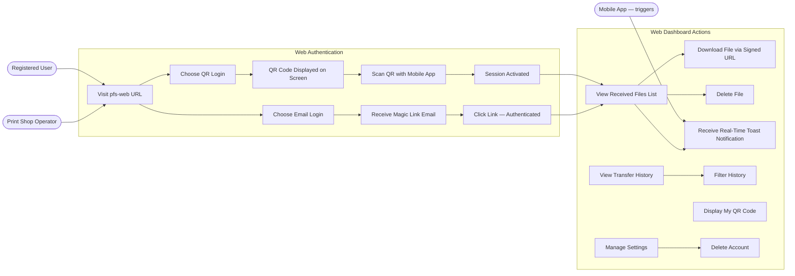
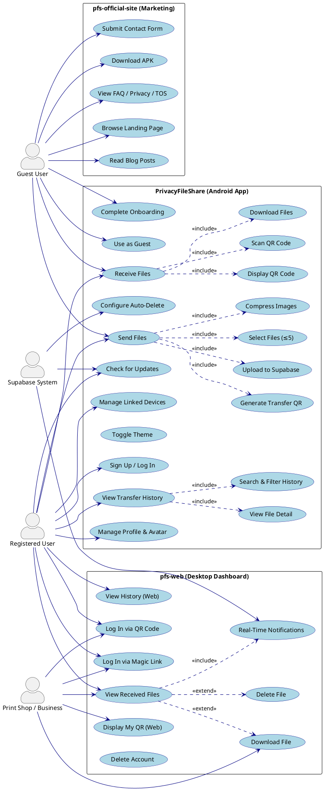

# PrivacyFileShare — Use Case Diagram

> **How to use this file:**
> Paste any diagram block into Claude, Gemini, or ChatGPT and ask:
> *"Render this Mermaid diagram"* or *"Draw this PlantUML diagram"*
> GitHub, GitLab, and Notion also render Mermaid natively.

---

## 1. Full System — All Actors & Use Cases (Mermaid)

```mermaid
%%{init: {"theme": "default", "themeVariables": {"fontSize": "14px"}}}%%
graph TD

  %% ─── ACTORS ───────────────────────────────────────────────────────────────
  subgraph Actors
    GU([Guest User])
    RU([Registered User])
    PS([Print Shop / Business User])
    SYS([Supabase System])
  end

  %% ─── PFS OFFICIAL SITE ────────────────────────────────────────────────────
  subgraph "pfs-official-site  (Marketing Website)"
    UC_BROWSE[Browse Landing Page]
    UC_LEARN[Learn Features & Privacy Policy]
    UC_BLOG[Read Blog Posts]
    UC_CONTACT[Submit Contact Form]
    UC_DL[Download Android APK]
    UC_FAQ[View FAQ]
    UC_ABOUT[View About Page]
    UC_TOS[Read Terms of Service]
  end

  %% ─── MOBILE APP ───────────────────────────────────────────────────────────
  subgraph "PrivacyFileShare  (Android App — Core Product)"
    UC_ONBOARD[Complete Onboarding]
    UC_GUEST[Use as Guest — No Sign-Up]
    UC_SIGNUP[Sign Up with Email]
    UC_LOGIN[Log In]
    UC_LOGOUT[Log Out]

    UC_SEND[Send Files]
    UC_SELECT[Select Files — up to 5]
    UC_COMPRESS[Compress Images]
    UC_GENQR[Generate QR Code]
    UC_UPLOAD[Upload Files to Supabase]

    UC_RECV[Receive Files]
    UC_DISPQR[Display My QR Code]
    UC_SCAN[Scan Sender QR Code]
    UC_DOWNLOAD[Download Files to Device]

    UC_HIST[View Transfer History]
    UC_SEARCH[Search History]
    UC_FILEDET[View File Detail]
    UC_DELETE[Delete Transfer Record]

    UC_PROFILE[Edit Profile]
    UC_AVATAR[Choose Avatar]
    UC_USERNAME[Set Username]

    UC_SETTINGS[Manage Settings]
    UC_THEME[Toggle Dark / Light Theme]
    UC_AUTODEL[Configure Auto-Delete]
    UC_COMPRESS2[Set Compression Preference]

    UC_LINKED[Manage Linked Web Devices]
    UC_REVOKE[Revoke Web Session]

    UC_UPDATE[Check for App Updates]
    UC_OFFLINE[View Offline Banner]
  end

  %% ─── WEB DASHBOARD ────────────────────────────────────────────────────────
  subgraph "pfs-web  (Web Dashboard)"
    UC_QRLOGIN[Log In via QR Code]
    UC_EMAILLOGIN[Log In via Email]
    UC_MAGIC[Receive Magic Link]

    UC_WEBDASH[View Received Files Dashboard]
    UC_WEBDL[Download File from Web]
    UC_WEBDEL[Delete File from Web]
    UC_WEBNOTIF[Receive Real-Time Notification]

    UC_WEBHIST[View Transfer History — Web]
    UC_FILTERH[Filter / Search History]

    UC_MYQR[Display My QR Code — Web]
    UC_WEBSETT[Manage Web Settings]
    UC_DELACCT[Delete Account]
  end

  %% ─── RELATIONSHIPS ─────────────────────────────────────────────────────────

  %% Marketing site
  GU --> UC_BROWSE
  GU --> UC_LEARN
  GU --> UC_BLOG
  GU --> UC_CONTACT
  GU --> UC_DL
  GU --> UC_FAQ
  GU --> UC_ABOUT
  GU --> UC_TOS

  %% Mobile — Guest
  GU --> UC_ONBOARD
  GU --> UC_GUEST
  GU --> UC_SEND
  GU --> UC_RECV
  GU --> UC_SCAN
  GU --> UC_HIST

  %% Mobile — Registered
  RU --> UC_SIGNUP
  RU --> UC_LOGIN
  RU --> UC_LOGOUT
  RU --> UC_SEND
  RU --> UC_RECV
  RU --> UC_HIST
  RU --> UC_PROFILE
  RU --> UC_SETTINGS
  RU --> UC_LINKED
  RU --> UC_UPDATE

  %% Mobile — Send flow inclusions
  UC_SEND --> UC_SELECT
  UC_SEND --> UC_COMPRESS
  UC_SEND --> UC_GENQR
  UC_SEND --> UC_UPLOAD

  %% Mobile — Receive flow inclusions
  UC_RECV --> UC_DISPQR
  UC_RECV --> UC_SCAN
  UC_RECV --> UC_DOWNLOAD

  %% Mobile — History
  UC_HIST --> UC_SEARCH
  UC_HIST --> UC_FILEDET
  UC_HIST --> UC_DELETE

  %% Mobile — Profile
  UC_PROFILE --> UC_AVATAR
  UC_PROFILE --> UC_USERNAME

  %% Mobile — Settings
  UC_SETTINGS --> UC_THEME
  UC_SETTINGS --> UC_AUTODEL
  UC_SETTINGS --> UC_COMPRESS2

  %% Mobile — Linked devices
  UC_LINKED --> UC_REVOKE

  %% Web — Print Shop
  PS --> UC_QRLOGIN
  PS --> UC_EMAILLOGIN
  PS --> UC_WEBDASH
  PS --> UC_WEBDL
  PS --> UC_WEBHIST
  PS --> UC_MYQR

  RU --> UC_QRLOGIN
  RU --> UC_EMAILLOGIN
  RU --> UC_WEBDASH
  RU --> UC_WEBDL

  %% Web login inclusions
  UC_EMAILLOGIN --> UC_MAGIC

  %% Web dashboard inclusions
  UC_WEBDASH --> UC_WEBDEL
  UC_WEBDASH --> UC_WEBNOTIF

  %% Web history
  UC_WEBHIST --> UC_FILTERH

  %% Web settings
  RU --> UC_WEBSETT
  UC_WEBSETT --> UC_DELACCT

  %% System actor
  SYS --> UC_WEBNOTIF
  SYS --> UC_AUTODEL
  SYS --> UC_UPDATE
```

---

## 2. Mobile App — Detailed Use Cases (Mermaid)

---

## 3. Web Dashboard — Use Cases (Mermaid)

---

## 4. PlantUML Version — Full System Use Case

> Paste into https://www.plantuml.com/plantuml/uml/ or any PlantUML renderer.

---

## Actor Summary Table

| Actor | System Involved | Primary Goals |
|---|---|---|
| **Guest User** | Official Site + Mobile | Browse info, download app, send/receive files without account |
| **Registered User** | Mobile + Web Dashboard | Full file transfer, history, profile, linked devices |
| **Print Shop / Business** | Web Dashboard | Receive files from customers via QR, download for printing |
| **Supabase System** | Backend (all apps) | Auto-delete expired files, send real-time events, auth tokens |

---

## Use Case Count by Module

| Module | Use Cases |
|---|---|
| pfs-official-site | 8 |
| PrivacyFileShare (Mobile) | 22 |
| pfs-web (Dashboard) | 10 |
| **Total** | **40** |
