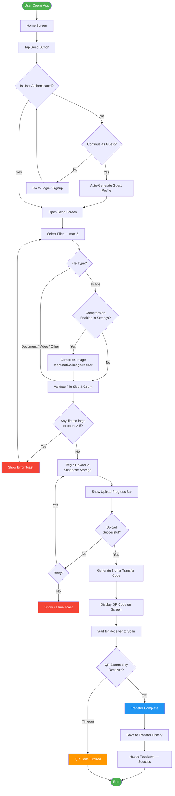
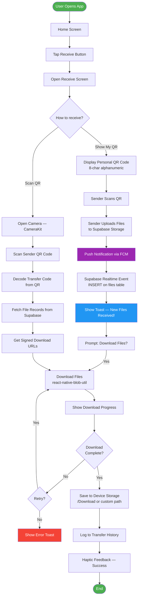
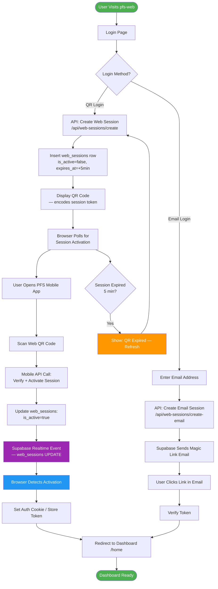
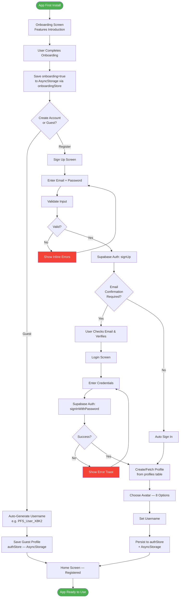
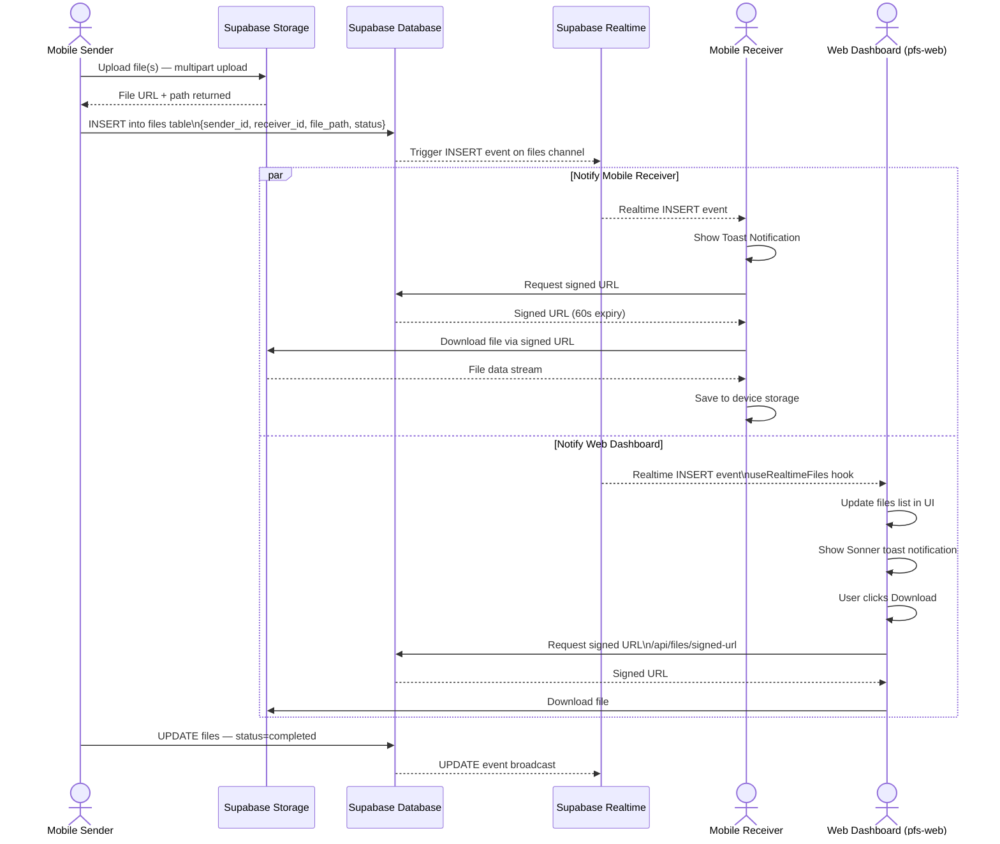
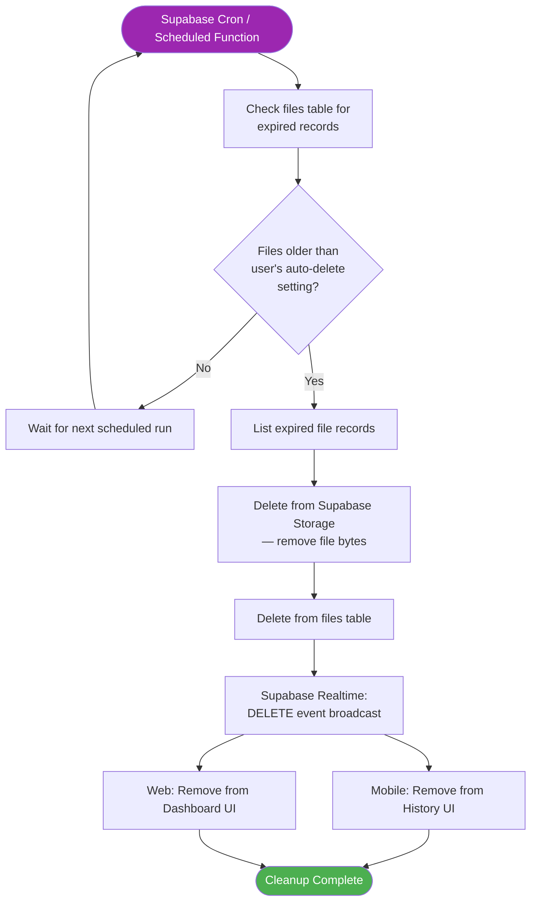
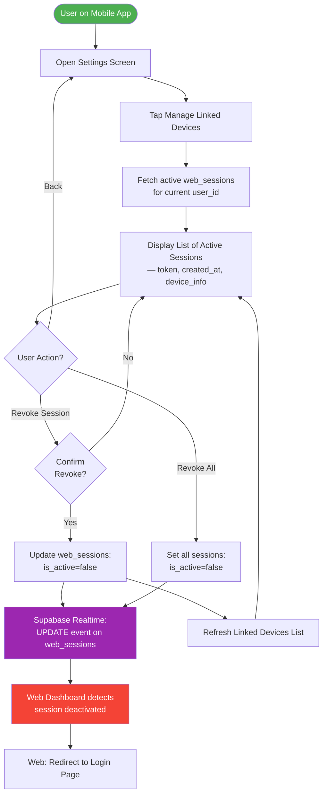
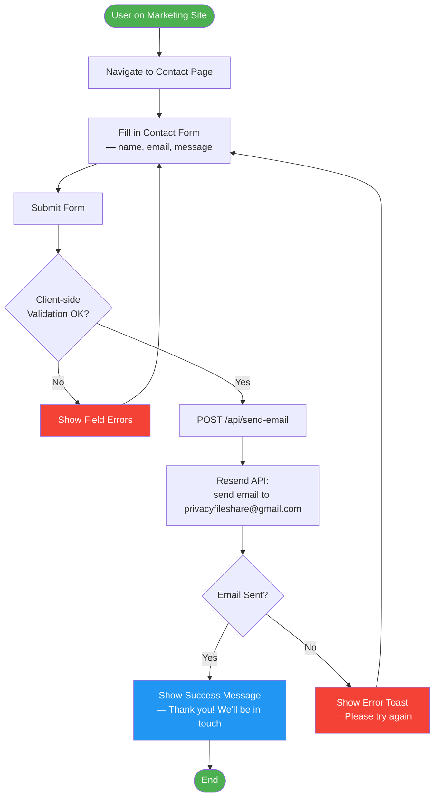

# PrivacyFileShare — Workflow Diagrams

> **How to use this file:**
> Paste any Mermaid block into Claude, Gemini, ChatGPT, or GitHub and ask to render it.
> Paste PlantUML blocks into https://www.plantuml.com/plantuml/uml/

---

## 1. File Sending Workflow (Mobile App)

---

## 2. File Receiving Workflow (Mobile App)

---

## 3. Web QR Login Workflow (pfs-web)

---

## 4. User Registration & Onboarding Workflow (Mobile App)

---

## 5. Real-Time File Sync Workflow (Mobile ↔ Supabase ↔ Web)

---

## 6. Auto-Delete Workflow (Background / System)

---

## 7. Linked Device (Web Session) Management Workflow (Mobile)

---

## 8. Contact Form Workflow (pfs-official-site)

---

## Workflow Summary Table

| # | Workflow | Actors Involved | Key Systems |
|---|---|---|---|
| 1 | **File Sending** | Guest / Registered User | Mobile App, Supabase Storage |
| 2 | **File Receiving** | Guest / Registered User | Mobile App, FCM, Supabase Realtime |
| 3 | **Web QR Login** | Registered User, Mobile App | pfs-web, Supabase Realtime |
| 4 | **Registration & Onboarding** | New User | Mobile App, Supabase Auth |
| 5 | **Real-Time File Sync** | Sender, Receiver, Web User | Supabase Realtime, Storage |
| 6 | **Auto-Delete** | Supabase System | Supabase Cron, Realtime |
| 7 | **Linked Device Management** | Registered User | Mobile App, Supabase |
| 8 | **Contact Form** | Visitor | Official Site, Resend API |
